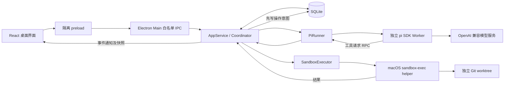

# Knotrail 原理与实现架构

本文描述当前工作区已写入代码的行为；本轮本地等待与维护扩展已通过回归、独立复核和实际打包态验证。此前的完整设计保存在 [设计记录](docs/DESIGN-V3.md)，其中的远端观察源、细粒度输入向量、动态扩展和更强执行隔离不能当作当前能力。运行步骤见 [使用手册](docs/USER-GUIDE.md)，函数与接口见 [代码文档](docs/CODE-GUIDE.md)，全目标状态见 [完成度审查](docs/COMPLETION-AUDIT.md)。

同计划局部重试新增独立研究上下文、资格复核和 retryCheckpoint。原 Run 与产物保持不变，后续输入变化会撤销复用资格。调用链和适用边界见 [研究复用](docs/RESEARCH-REUSE.md)。

## 1. 它解决什么问题

Knotrail 是一款基于 pi 的个人编码桌面 Agent。它把任务的规划、执行、变更、检查和恢复做成可查阅的记录。用户可以关掉右侧规划栏，任务仍然先规划；打开后，过程、图或列表、节点产物、检查和历史都来自同一份持久化快照。

当前差异点是可用的工作流程，而不是未经测量的模型能力：用户能在执行前看到计划，在执行中定位步骤，在改需求前看到哪些节点失效，在失败后查看真实工具结果。它没有证据证明比 Codex 或其他商业产品的任务成功率更高，也不宣称这些概念为业内独有。

## 2. 实际调用链

Main 是任务状态与效果准入的唯一所有者。模型 Worker 不直接修改项目、不加载项目扩展、不持有桌面 IPC。工具请求回到 Main，先记录 pending 回执，再进入独立执行进程。模型的“完成”只是一条建议；固定验收由 Main 再运行，结果合格才改变最终任务状态。

pi 负责模型消息、工具循环、用量和会话文件。当前接线关闭自动上下文压缩，单次 Run 仍受配置的 contextWindow 约束。Knotrail 负责跨会话的 Task、Plan、Run、检查和恢复。两层不分别实现一套聊天循环。

## 3. 数据如何区分

| 实体 | 保存内容 | 权威边界 |
| --- | --- | --- |
| Task | 当前目标、交互方式、模式、预算、状态、工作树、活动计划 | Main 写入 |
| TaskRevision | 每次目标和用户验收的历史快照 | 修改目标或固定验收追加，不覆盖历史 |
| PlanDraft | 递增 sequence、观察、摘要、候选节点 | 可展示，不允许直接执行 |
| PlanRevision | 完整节点、依赖、检查引用、摘要与 digest | Worker 收尾与来源核对后追加 |
| NodeState | 当前计划的节点状态、尝试次数、输入和输出摘要 | Main 更新 |
| Run | 一次规划、节点尝试或维护复验的身份、状态、时间和输入摘要 | 规划/节点新建 pi Session；verification 只运行固定检查 |
| ActionReceipt | 工具类型、参数摘要、pending/succeeded/failed/unknown、输出 | 执行边界生成 |
| CheckReceipt | 固定条件 ID、批次、Task/Plan 版本、检查定义摘要、文件摘要、已消费观察摘要和输出 | Main 的检查器生成 |
| Artifact | 节点报告、该次运行结束时的累计 diff、摘要 | Main 收集；不是模型自填的状态 |
| TaskEvent | 有序事件编号、时间、所属任务版本、Run、节点 | UI 通知只提示更新，快照才是事实 |
| Decision | 当前任务版本的问题、可选答案与实际回答 | 用户回答由 Main 校验 |
| WaitState | 来源、条件、基线、Task/Plan/Run/Node、最近观察与消费时间 | Main 在 Run 收尾后读取来源并登记 |
| HealthObservation | 最近维护结果、时间、批次、Run、输入摘要与漏查区间 | Main 固定检查批次生成，不由模型自报 |

SQLite 开启 WAL 和 FULL synchronous。当前每个任务保存一个 JSON 快照，便于个人任务的原子更新；项目、偏好、一次性预览和幂等请求独立成表或键值项。该设计有明确容量上限：长到数万事件的任务应改为独立事件表，而不是继续无限扩大 JSON。

数据库事务只能保证记录的原子性，不能把外部命令变成 exactly-once。进程退出前可能已经写文件但尚未回传，所以重启把未完成回执标记为 unknown，并阻止自动重放。

## 4. 先规划如何被强制

规划 Worker 的工具只有 `read_file`、`list_files`、`search_files`、`update_plan` 和 `outcome`。没有写入、编辑和命令工具；Main 也独立拒绝规划阶段的写请求。

`update_plan` 可以提交不完整的公开草稿，也可以提交最终计划。草稿 sequence 必须递增。最终提交要求至少一个节点、节点 ID 唯一、依赖存在、无环、检查 ID 有效，并且每个用户固定验收都有节点引用。规划期间展示的是明确生成的事实、约束、方案和步骤，不是模型隐藏的内部思维链。

提交先保存候选草稿并关闭该 Run 的后续工具准入。Worker 结束后，Main 核对 TaskRevision、前一 Plan 和规划开始时的工作区摘要；仍一致才追加 PlanRevision 并进入 `ready`。PlanRevision 保存 planningRunId，显式关联产生该计划的 Run。发布前回读该 Run 的结构化文件读取摘要，并保存 inputSourcesDigest；来源变化时保留草稿、阻止发布。Ready 后至首次执行前同时核对工作区与已知来源摘要，变化会要求重新规划。恢复执行时，最近完成节点的 outputSourcesDigest 或已接受来源摘要变化，也会撤销当前完成资格；历史产物保持不变。`reviewBeforeExecute` 停在这里等待用户开始；`autoWithinGrant` 在既有任务权限内自动继续。关闭右侧面板不会改变这段协议。

节点数量最多 60。图允许分支，但当前执行器串行选择依赖已结束的节点，没有隐式开启并行 Agent 写文件。计划任务依赖必须为 verified；会话中没有配置检查的节点使用 finished，只表示该步骤已结束。

## 5. 单次运行如何结束

Worker 必须产生结构化控制结果：完成、请求用户决定、登记外部等待或阻塞。仅输出“做好了”而没有结果工具会失败。超时、预算耗尽和取消也会收尾并保存结果。

每个实际模型 turn 开始就发送事件，Main 立即累计任务预算。这样模型报错或被中止也不会把已发生的轮数抹掉。默认预算 40 轮；计划任务跨 Run 累计，快速会话按每条明确的新消息计算。新任务界面默认每个 Run 最多 15 分钟，接口未指定时默认 10 分钟，可在高级选项调整。单个工具或检查最多 120 秒，输出最多约 64 KiB。

节点成功后运行其引用的固定检查；所有节点结束后，再对当前工作树运行全部用户验收。计划任务没有检查命令时，对当前文件摘要提出一次明确的人工验收；人工验收前文件变化会撤销这次验收权威。快速会话没有命令时以 idle 等待下一条消息，不设置 acceptedDigest，也不声称完成验收；有固定命令时仍要求当前批次通过。

### 快速会话如何持续

`Task.interaction=conversation` 使用同一 Task 和工作树承载多条消息；缺少该字段的旧记录仍按计划任务处理。`task.message` 校验 requestId 与 expectedRevision，停止旧 Run，经过未知效果恢复门，再把新目标、TaskRevision、user.message 事件与去重记录原子保存。它保留固定验收、执行策略、旧计划和产物，不自动重放之前的文件效果。已停止会话只有用户明确发送新消息后才开始新一轮。

每条消息仍走 Planning Run → 校验发布 → Node Run。会话完成一轮后进入 idle；下一条消息创建新版本，不创建另一棵工作树。`turnCount` 累计保留，`turnBudgetStart` 只在接受新消息时更新；本轮可用预算按两者的差计算，恢复和重试不会补发预算。

消息复用既有事件表：task.created 是首条用户消息，user.message 是追加消息，assistant.response 保存节点明确返回的摘要。`conversationHistory()` 向 pi 传入最近最多 24 条、64,000 个字符的有序历史及省略数量；数据库保留完整历史。它与每 Run 新建 pi Session 的现有机制配合，不建立另一套模型循环，尚未实现历史压缩。前驱产物另通过当前 Run 的固定输入绑定提供，见下文。

检查命令在创建或用户修订任务时保存为 argv 数组，不通过 shell 字符串拼接。模型不能替换用户的检查定义。保护路径不能被工具或检查命令改写。同一检查批次绑定唯一的 TaskRevision、Plan ID、检查定义摘要、工作区摘要，以及声明文件和实际已知读取的独立来源摘要。依赖目录虽不计入工作区摘要，已知来源仍须在整个检查批次与发布时稳定；不能采集时禁止验收。无自动检查的人工接受也保存并核对来源摘要；若任务消费过等待来源，还绑定 observationDigest 并重新读取该来源。检查前后、检查之间及最终提交时都要核对这些绑定。不同文件或观察版本的 pass 不能合并验收，最终 acceptedDigest 只能取已验证的工作区摘要。这是当前单个登记来源的查证，还不是原设计中的完整外部输入向量。

### 固定输入与真实产物

计划的输入必须明确为当前工作树文件，或某个前驱节点的指定 outputId；输出必须声明文件状态或固定的 summary 文本。提交计划时校验安全相对路径、输出 ID 唯一性、祖先依赖和产物声明。旧字符串计划继续供历史查看，执行前须重新规划。

节点开始时，Main 将文件内容或前驱产物绑定到该 Run。前驱身份必须同时匹配当前 TaskRevision、Plan、NodeState 的 runId/attempt 及成功状态；不按名称寻找旧版本。文件快照记录来源身份、存在状态、原始字节摘要和权限，实际保存文本先过滤已知凭据再计算内容摘要。不存在与空文件是不同状态。单文件最多 2 MiB，必须完整、稳定、有效 UTF-8；二进制、超限或读取变化会阻止执行。

Run 准入时还保存 sourcePremises：当前计划的声明文件、规划及既有节点已知读取的来源状态。工具执行前、开始检查前和产物发布事务内，统一核对这些前提与本次实际读取，防止读取 H1 后在 H2 上开启新检查而错误接受旧结论。对这些已知或实际读取来源，研究节点不允许变化，编辑或验证节点仅豁免已声明的文件输出。该检查不是全工作树写入白名单，未声明且未观察的文件与命令隐含写入没有完整追踪证明。后继节点准入（包括决定与等待后的继续）及最终验收建批前，还核对当前最近完成节点的 outputDigest/outputSourcesDigest；中间的未完成 Run 不会遮蔽该节点。来源集合按该完成 Run 的历史位置还原，后续新增读取不会被误当作原来源变化；两步之间来源变化会撤销当前节点资格并阻止继续，历史保持不变。维护复验仍显式观察当前状态。决定或等待正常收尾时，先核对非可变来源，再保存 Run.suspendedState，记录合法写入后的工作区与已知来源摘要；恢复校验此状态，既保留已发生的合法写入，也拒绝等待期间其他来源变化。声明的 workspace_file 等待条件满足后，若该新观察改变了工作区，则先撤销旧节点资格、按新来源重新运行；不把旧结论直接用于新状态。历史前驱产物是固定快照，不要求它与后来修改过的当前文件相同。

运行器先收到每份输入最多 4,096 个字符、合计最多 64,000 个字符的预览；其余文本通过 read_input 分段读取同一份保存内容。范围使用 UTF-16 半开区间，记录交给运行器的文本，不证明服务端收到或模型理解。每 Run 输入、输出各限制为 8 MiB。read_file 另外返回结构化字节摘要与完整性；列表、搜索、命令或缺少完整读取证据时，输入覆盖标为 unknown。

模型与工具结束、固定检查运行后，Main 采集声明文件和 outcome.summary；提交时再次检查批次与文件来源，将节点完成和声明产物放进同一事务。缺失输出、损坏快照或失败的新尝试不能为后续步骤提供产物。累计 diff 仍用于变更视图，不代替文件快照。后续步骤可以覆盖相同文件，早期快照仍代表当时的内容；无检查的会话产物可以用作上下文，但不因此成为已验收结果。

研究节点在 Worker 和 Core 两处禁止写入及命令工具。这为研究复用提供读取记录；当前仍没有完整隐式依赖、研究问题等价性或选择性复用证明，不能将 declared 覆盖标识解读为这些能力已经完成。

## 6. 变更与重试

用户修改目标或固定验收时，Main 先停止当前任务、等待 Worker 和已准入工具收尾，再生成影响预览。预览包含当前任务版本、活动计划、工作树摘要、声明文件与实际读取来源的独立摘要，以及一次性 host ID。确认时必须与数据库中签发的原件一致，并重新校验计划和文件摘要。消费后的预览不能换一个请求 ID 再重放。

修改目标或固定验收创建 TaskRevision，保存当时的目标及完整 CheckSpec，保留旧 PlanRevision、Run、回执和产物；当前版本重新规划。省略 checks 表示保留原检查，显式空数组表示删除自动检查：单次或有限计划任务随后必须人工验收，快速会话只结束本轮回复；维护任务始终需要至少一个检查。检查变化会撤销旧的 acceptedDigest、节点完成资格和待答决定，下一版计划必须覆盖全部新检查。v0.1 保守地使全部旧节点失效，没有声称能够精准复用未变的调研。

验收编辑器与新任务表单共用字段和解析。应用前按检查 ID 比较标签、命令与受保护路径，用户确认的是 Main 签发的完整预览；TaskRevision、预览消费、事件和 requestId 在同一 SQLite 事务内提交。新 Run 从新 Task 获取保护路径，模型没有修改用户检查定义的控制命令。历史计划、检查回执和终端命令按其 TaskRevision 找回当时的定义；缺少历史定义时显示未记录，不套用同 ID 的新定义。导出报告同时保留各版目标和检查。

重试会使指定节点、不具复用资格的已有尝试及其依赖后继失效。研究节点使用独立上下文，只有输入、上下文和产物均可核对的成功研究可以保留；未运行且不受影响的排队节点也可保留。retryCheckpoint 记录本次继续的文件基线，原 Run 与产物不变。重试从现在的文件状态开始，历史效果不会被隐式回滚。工作树没有自动 reset、stash、clean，也不会自动 push、merge 或发布。

预览取消后，任务保持暂停，用户可以继续。计划任务的完成、取消和过期仍是终态；快速会话可由用户明确发送下一条消息继续，且不能绕过未知效果恢复门。

## 7. 工作树与文件证据

任务从一个干净且已有提交的 Git 仓库创建独立 detached worktree。源仓库有未提交或未跟踪内容时拒绝创建，并保留所有源文件。v0.1 不支持源树中的 symlink 和 submodule。

创建过程使用 `worktree add --no-checkout`、读取 Git tree/blob 并写出普通文件、`read-tree` 填充索引，避免 checkout hook 和过滤器执行。脏文件判断逐项比较 HEAD blob、索引和原始文件；累计 diff 由 HEAD 原始 blob 与当前文件交给系统 diff 生成，不调用会触发 clean filter 的 Git status/diff。Git fsmonitor 不运行。模型工具不能访问 `.git` 管理路径。

证据摘要按排序后的相对路径、文件内容和权限位计算 SHA-256。排除 `.git`、`node_modules`、`.knotrail`；因此它证明项目文件状态，不是整台机器或完整依赖环境的可复现证明。扫描上限为 30,000 文件、128 MiB。文本预览截断于 256 KiB，工具单文件上限 2 MiB。

恢复首先检查未处置的 pending/unknown 效果回执。未知文件写入冻结所属任务；未知命令或固定检查保守冻结 App 中的新效果。只读动作的 unknown 不触发效果冻结。确定性文件操作先尝试下述状态查证；其余情况由 Main 展示回执、当前差异和工作区摘要，要求用户明确保留当前文件重新规划或停止。决定绑定动作集合、Task/Plan 与工作区摘要；来源变化后必须重新查证。原回执保持 unknown，另存 resolution，不伪造历史成功。取消或到期后可以单独查证并处置回执，终态任务不会重新运行。

工具和固定检查共用 executeRecorded：pending 持久化失败时不准入效果；准入后的执行器异常或结果写库失败保留 unknown，并中止本 Run。持续存储故障在内存中冻结新效果，重启后仍由磁盘 pending 触发恢复。通用命令仍没有语义幂等保证，用户处置不能冒充操作执行成功。

文件写入还包含一次持久握手。helper 在创建目标父目录或替换临时文件前，发送 FileMutationIntent：规范路径、写前存在性/字节摘要/权限、预期写后摘要/权限。Core 复核原始 ToolCall、Run/Plan、读取前提与当前文件，为意图绑定根目录来源身份，然后在 synchronous=FULL 的 SQLite 事务中保存。只有收到保存完成的 ACK，helper 才允许开始写入，并在替换前重验路径和原内容。保存失败、取消或宿主死亡不会放行迟到 ACK。

用户点击继续或查看未知效果时，Main 先停止活动链，再只读查证具有意图的文件；任何仍运行的任务或未知命令都会阻止自动查证。文件来源身份、内容与权限均匹配预期写后状态时，保存 filePostcondition 及观察时间，保留历史 unknown，不推断该操作确曾执行。非终态任务清除原计划的执行资格，同一目标版本重新生成 Plan；不自动重发旧 ToolCall。只查看证据不会启动运行，终态保持停止。观察记录也进入新 Planner 的上下文。没有意图、不可读、状态不同或命令效果继续走人工恢复卡片。前后相同的无操作写入也只能证明观察时的状态，不能证明因果或 exactly-once。

确认未知效果已处置后，恢复比较当前摘要和最近有效证据；发生变化则使节点证据失效。节点产物保存的是运行结束时的累计工作树 diff，并非可独立应用和回滚的节点 patch。

## 8. 长任务

`once` 完成一次目标，拒绝外部等待；`finite` 必须指定截止时间与任务检查间隔，允许模型登记一次有明确来源的等待；`maintain` 必须提供至少一个固定检查，初次开发验收后进入周期复验。任务的模型预算跨 Run 累计，等待和维护观察都不重置预算。

### 文件等待

`outcome(kind=wait)` 包含原因、分钟间隔、相对来源路径，以及 `changed`、`exists` 或 `contains` 条件。`workspace_file` 读取任务 worktree；`project_file` 读取所选原项目。两者都限于可读取的普通文本文件，拒绝越界、`.git`、符号链接、非普通文件、截断内容和超过 32,000 字符的来源。原项目文件是单独的观察数据，不会自动复制、合并或变基到任务 worktree。

Main 等 Runner 及其工具收尾后，读取来源并建立 WaitState。来源身份包含规范化根目录、文件系统设备/目录身份和相对来源声明，绑定 TaskRevision、Plan、Run 和 Node；内容摘要或明确的缺失值成为基线。`changed` 比较登记后的内容变化，因此本次 Run 自己写入的内容不会立即唤醒自身；`exists` 和 `contains` 可以在登记时就满足。

到期后，`observeWait()` 先刷新来源。条件未满足时继续等待；无法读取或来源根目录身份变化时记录 unknown，并只重试观察。满足条件且相对于最近消费有新信息时，才在事务中记录 consumedAt 并继续任务。consumedObservations 是按节点、来源身份/路径和条件分组的“最近已消费摘要”映射，不是终身保存所有见过内容的集合；连续重复相同状态不再触发，实际观察到 A → B → A → B 可以继续推进。已观察到条件不满足后，又恢复为此前相同的满足内容，也是一轮新变化。unknown 不算条件明确不满足。恢复暂停的等待仍先观察。

用户明确应用新目标、重试预览，或对非终态任务完成保留并重新规划的恢复处置后，会清空当前去重映射；历史观察仍留在 events。新工作可以使用当前已有的合格信息一次，后续连续重复仍受去重限制。

新 Run 的 context 带入这次观察的身份、时间、内容和消费信息；内容被视为数据。`observationCurrent/assertObservation` 在 drive、Run 开始、普通工具/检查准入、Run 收尾、计划发布和非恢复决定接受时重新读取已消费来源；变化或不可达会先阻止继续，要求用户查证并明确修改或重试。受其影响的检查回执仍绑定 observationDigest，在验收时复核。来源文件不存在与来源不可达不同：缺失可使 exists/contains 保持等待，也可在已有基线的 changed 条件下成为一次变化。

### 维护复验与漏查

初次开发完成后，维护到期只创建 `purpose=verification` 的 Run，执行 Task 已保存的固定检查，生成 `scope=maintenance` 的批次，不创建 pi Session，也不重新执行原计划写节点。稳定输入上的全部检查通过为 healthy，明确检查失败为 unhealthy，执行中断或来源在批次间变化为 unknown。每次保存检查时间、工作区摘要、batchId、runId 和原因；healthy 仅说明该次观察成立。

后续周期继续检查当前文件；用户可以自行修复后等下一次复验，也可以通过修改要求或重做节点明确发起开发。普通 Resume 对已有维护记录只请求再检查。未知命令效果仍受恢复门约束，不能靠定时器或 Resume 跳过处置。验证 Run 没有模型用量，前端汇总时将它与用量缺失的模型 Run 区分。

等待和维护的 nextCheckAt 都持久化。同一 Task 只有一个排队项；多个错过周期合并为一次当前观察或检查，记录 missedIntervals 和 gapSince，不按每个历史周期补跑模型或命令。App 关闭、系统休眠期间没有观察，启动或恢复运行后的定时扫描补查当前状态。异常中断的活动 Run 仍先进入恢复流程。

主对话、右侧规划过程和定时任务页共用观察卡片，展示来源/条件、最近与下次观察、维护批次和漏查区间；已有 consumedAt 时显示实际消费时间。报告保留观察、消费字段及事件。卡片的 satisfied 仅表示来源条件满足；连续重复内容可能仍在等待。等待及三种维护状态已加入暂停入口。来源撤销、显式修订和反复实际变化的反例已通过回归和独立复核；实际打包态验证已通过，真实长期任务验收仍未完成。

当前没有 CI API adapter、webhook、跨机器调度或 SLA。原计划中的只读 CI 来源仍是“真实案例需要时”接入的条件项，不能用本地状态文件冒充平台仓库、提交和检查身份认证。

## 9. 桌面权限与模型配置

Renderer 使用 sandbox、contextIsolation，关闭 Node 集成。preload 只暴露固定 command、事件订阅、原生目录选择、报告导出。Main 检查发送者窗口和主 frame、命令大小及 Zod 字段，禁止新窗口、外部导航、webview 和页面权限申请。

API 模式的密钥通过 Electron safeStorage 加密后存在用户数据目录。Renderer 可以替换或清除密钥，但读取设置只得到 `hasApiKey`。模型请求只在 pi Worker 发出，工具 helper 不继承凭据。Worker 在保存会话前过滤当前访问凭据，流式文本保留可能跨分片的凭据前缀；PiRunner 与 Core 再过滤事件、结果和嵌套字段。Core 保留本次宿主生命期内用过的敏感值用于过滤轮换后的旧值，不将其持久化。

API 模式允许 HTTPS，以及仅回环地址上的 HTTP；拒绝带用户名、密码、查询参数或片段的 URL。连接检查调用 `/models` 并匹配模型 ID，它不等于工具调用成功。

Codex 模式由用户明确选择。Core 每个 Run 从 Codex 本机登录缓存重新读取 access token，校验普通文件、大小、JSON、ChatGPT 模式、JWT 账户字段与到期时间；不提取刷新凭据、不写回缓存，也不负责登录或刷新。固定官方 `https://chatgpt.com/backend-api/codex/responses` 是唯一模型请求目的地，强制 SSE、POST 和拒绝重定向。模型注册保留 `openai-codex` provider 身份，避免跨轮工具 ID 被转换。pi 目录包含 `gpt-6-astra`，但目录存在和本地登录检查不能证明服务端可用。

Run 期限取任务预算与 access token 到期时间的较早值，到期取消后须回到 Codex 更新登录。Codex Responses 的输出额度由服务控制；该路径不宣称本地 maxTokens 能限制服务端生成。任务轮数、运行时间和沙箱限制继续生效。ChatGPT 订阅认证与独立计费的 Platform API key 是两种接入方式；实现依据见 [官方认证说明](https://learn.chatgpt.com/docs/auth)。真实账户任务和本机安装证据单列于验证记录。

## 10. 执行隔离的准确范围

macOS `sandbox-exec` 限制文件读写和网络；工具只能写任务工作树与自己的临时目录，默认禁止网络。受保护路径及其祖先目录重命名被阻止。文本写入要求 expectedContent 或 SHA-256 与当前文件匹配，使用临时文件原子替换并保留执行权限位。

Main 持有内核 flock。执行 helper 继承同一个文件描述符，Main 崩溃时旧 helper 仍持有租约；普通子进程通过管道断连与进程组清理退出后才允许新 owner。没有依赖 Node/Electron ABI 的原生锁模块。

**这不是用于任意敌对仓库的完整虚拟机隔离。** 已验证普通后代取消、断连清理和越界写拒绝；也通过受控实验确认，恶意程序可以通过 detached/setsid 脱离进程组并继续在原工作树中活动。因此只执行可信项目的命令，不声称所有恶意守护进程都能被回收。需要该保证时必须更换为有独立生命周期的 VM/container 执行后端。其他平台和系统沙箱不可用时拒绝执行，没有自动退回 unrestricted shell。
