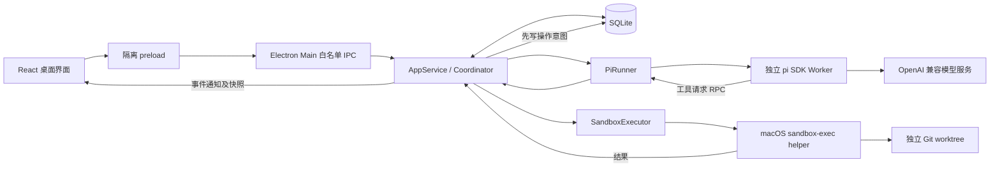

# Knotrail 原理与实现架构

本文描述 v0.1.0 已写入代码的行为。此前的完整设计保存在 [设计记录](docs/DESIGN-V3.md)，其中的远端观察源、细粒度输入向量、动态扩展和更强执行隔离不能当作当前能力。运行步骤见 [使用手册](docs/USER-GUIDE.md)，函数与接口见 [代码文档](docs/CODE-GUIDE.md)。

## 1. 它解决什么问题

Knotrail（程迹）是一款基于 pi 的个人编码桌面 Agent。它把任务的规划、执行、变更、检查和恢复做成可查阅的记录。用户可以关掉右侧规划栏，任务仍然先规划；打开后，过程、图或列表、节点产物、检查和历史都来自同一份持久化快照。

当前差异点是可用的工作流程，而不是未经测量的模型能力：用户能在执行前看到计划，在执行中定位步骤，在改需求前看到哪些节点失效，在失败后查看真实工具结果。它没有证据证明比 Codex 或其他商业产品的任务成功率更高，也不宣称这些概念为业内独有。

## 2. 实际调用链

Main 是任务状态与效果准入的唯一所有者。模型 Worker 不直接修改项目、不加载项目扩展、不持有桌面 IPC。工具请求回到 Main，先记录 pending 回执，再进入独立执行进程。模型的“完成”只是一条建议；固定验收由 Main 再运行，结果合格才改变最终任务状态。

pi 负责模型消息、工具循环、用量和会话文件。当前接线关闭自动上下文压缩，单次 Run 仍受配置的 contextWindow 约束。Knotrail 负责跨会话的 Task、Plan、Run、检查和恢复。两层不分别实现一套聊天循环。

## 3. 数据如何区分

| 实体 | 保存内容 | 权威边界 |
| --- | --- | --- |
| Task | 当前目标、模式、预算、状态、工作树、活动计划 | Main 写入 |
| TaskRevision | 每次目标和用户验收的历史快照 | 修改目标追加，不覆盖历史 |
| PlanDraft | 递增 sequence、观察、摘要、候选节点 | 可展示，不允许直接执行 |
| PlanRevision | 完整节点、依赖、检查引用、摘要与 digest | Worker 收尾与来源核对后追加 |
| NodeState | 当前计划的节点状态、尝试次数、输入和输出摘要 | Main 更新 |
| Run | 一次规划或节点尝试的身份、状态、时间、会话路径和用量 | 每次新建独立 pi Session |
| ActionReceipt | 工具类型、参数摘要、pending/succeeded/failed/unknown、输出 | 执行边界生成 |
| CheckReceipt | 固定条件 ID、批次、Task/Plan 版本、检查定义摘要、文件摘要和输出 | Main 的检查器生成 |
| Artifact | 节点报告、该次运行结束时的累计 diff、摘要 | Main 收集；不是模型自填的状态 |
| TaskEvent | 有序事件编号、时间、所属任务版本、Run、节点 | UI 通知只提示更新，快照才是事实 |
| Decision | 当前任务版本的问题、可选答案与实际回答 | 用户回答由 Main 校验 |

SQLite 开启 WAL 和 FULL synchronous。当前每个任务保存一个 JSON 快照，便于个人任务的原子更新；项目、偏好、一次性预览和幂等请求独立成表或键值项。该设计有明确容量上限：长到数万事件的任务应改为独立事件表，而不是继续无限扩大 JSON。

数据库事务只能保证记录的原子性，不能把外部命令变成 exactly-once。进程退出前可能已经写文件但尚未回传，所以重启把未完成回执标记为 unknown，并阻止自动重放。

## 4. 先规划如何被强制

规划 Worker 的工具只有 `read_file`、`list_files`、`search_files`、`update_plan` 和 `outcome`。没有写入、编辑和命令工具；Main 也独立拒绝规划阶段的写请求。

`update_plan` 可以提交不完整的公开草稿，也可以提交最终计划。草稿 sequence 必须递增。最终提交要求至少一个节点、节点 ID 唯一、依赖存在、无环、检查 ID 有效，并且每个用户固定验收都有节点引用。规划期间展示的是明确生成的事实、约束、方案和步骤，不是模型隐藏的内部思维链。

提交先保存候选草稿并关闭该 Run 的后续工具准入。Worker 结束后，Main 核对 TaskRevision、前一 Plan 和规划开始时的工作区摘要；仍一致才追加 PlanRevision 并进入 `ready`。来源变化时保留草稿、阻止发布。Ready 后至首次执行前的来源变化也会要求重新规划。`reviewBeforeExecute` 停在这里等待用户开始；`autoWithinGrant` 在既有任务权限内自动继续。关闭右侧面板不会改变这段协议。

节点数量最多 60。图允许分支，但当前执行器串行选择依赖已经 verified 的节点，没有隐式开启并行 Agent 写文件。

## 5. 单次运行如何结束

Worker 必须产生结构化控制结果：完成、请求用户决定、登记外部等待或阻塞。仅输出“做好了”而没有结果工具会失败。超时、预算耗尽和取消也会收尾并保存结果。

每个实际模型 turn 开始就发送事件，Main 立即累计任务预算。这样模型报错或被中止也不会把已发生的轮数抹掉。默认总预算 40 轮、每个 Run 最多 10 分钟，可在新任务中调整。单个工具或检查最多 120 秒，输出最多约 64 KiB。

节点成功后运行其引用的固定检查；所有节点结束后，再对当前工作树运行全部用户验收。如果用户没有提供命令，不自动声称任务合格，而是对当前文件摘要提出一次明确的人工验收。人工验收前文件变化会撤销这次验收权威，要求重新检查。

检查命令在创建任务时保存为 argv 数组，不通过 shell 字符串拼接。模型不能替换用户的检查定义。保护路径不能被工具或检查命令改写。同一检查批次绑定唯一的 TaskRevision、Plan ID、检查定义摘要和工作区摘要；检查前后、检查之间及最终提交时都要核对这些绑定。不同文件版本的 pass 不能合并验收，最终 acceptedDigest 只能取已验证的摘要。

## 6. 变更与重试

用户补充目标时，Main 先停止当前任务、等待 Worker 和已准入工具收尾，再生成影响预览。预览包含当前任务版本、活动计划、工作树摘要和一次性 host ID。确认时必须与数据库中签发的原件一致，并重新校验计划和文件摘要。消费后的预览不能换一个请求 ID 再重放。

修改目标创建 TaskRevision，保留旧 PlanRevision、Run、回执和产物；当前版本重新规划。v0.1 保守地使全部旧节点失效，没有声称能够精准复用未变的调研。

重试某个节点使该节点及其依赖后继失效，其他节点保留。重试从现在的文件状态开始，历史效果不会被隐式回滚；执行提示包含之前的结果和已回答决定。工作树没有自动 reset、stash、clean，也不会自动 push、merge 或发布。

预览取消后，任务保持暂停，用户可以继续。完成、取消和过期是当前任务的终态，新的目标应创建新任务。

## 7. 工作树与文件证据

任务从一个干净且已有提交的 Git 仓库创建独立 detached worktree。源仓库有未提交或未跟踪内容时拒绝创建，并保留所有源文件。v0.1 不支持源树中的 symlink 和 submodule。

创建过程使用 `worktree add --no-checkout`、读取 Git tree/blob 并写出普通文件、`read-tree` 填充索引，避免 checkout hook 和过滤器执行。脏文件判断逐项比较 HEAD blob、索引和原始文件；累计 diff 由 HEAD 原始 blob 与当前文件交给系统 diff 生成，不调用会触发 clean filter 的 Git status/diff。Git fsmonitor 不运行。模型工具不能访问 `.git` 管理路径。

证据摘要按排序后的相对路径、文件内容和权限位计算 SHA-256。排除 `.git`、`node_modules`、`.knotrail`；因此它证明项目文件状态，不是整台机器或完整依赖环境的可复现证明。扫描上限为 30,000 文件、128 MiB。文本预览截断于 256 KiB，工具单文件上限 2 MiB。

恢复首先检查未处置的 pending/unknown 效果回执。未知文件写入冻结所属任务；未知命令或固定检查保守冻结 App 中的新效果。只读动作的 unknown 不触发效果冻结。Main 展示回执、当前差异和工作区摘要，并要求用户明确保留当前文件重新规划或停止。决定绑定动作集合、Task/Plan 与工作区摘要；来源变化后必须重新查证。原回执保持 unknown，另存 resolution，不伪造历史成功。取消或到期后可以单独查证并处置回执，终态任务不会重新运行。

工具和固定检查共用 executeRecorded：pending 持久化失败时不准入效果；准入后的执行器异常或结果写库失败保留 unknown，并中止本 Run。持续存储故障在内存中冻结新效果，重启后仍由磁盘 pending 触发恢复。当前没有自动文件后置状态证明或通用命令语义幂等，用户处置不能冒充这些保证。

确认未知效果已处置后，恢复比较当前摘要和最近有效证据；发生变化则使节点证据失效。节点产物保存的是运行结束时的累计工作树 diff，并非可独立应用和回滚的节点 patch。

## 8. 长任务

`once` 完成一次目标；`finite` 允许结构化外部等待，必须指定截止时间与检查间隔；`maintain` 在合格后保持 healthy，按间隔再次核对。等待以数据库 `nextCheckAt` 保存，进程中的短定时器只负责发现到期任务。

应用关闭或系统休眠期间没有后台云进程。重新启动后可以发现到期等待；正在执行但未完成的操作会进入人工恢复，不假装连续运行。一个任务不会因定时器重复触发而产生多个并发执行者。

当前没有 webhook、跨机器调度、外部事件去重服务或 SLA。维护检查失败会阻塞并展示回执；是否修复、修改目标或重试由用户明确决定。总轮数仍受原任务预算限制，不会因为长期模式而无限花费。

## 9. 桌面权限与模型配置

Renderer 使用 sandbox、contextIsolation，关闭 Node 集成。preload 只暴露固定 command、事件订阅、原生目录选择、报告导出。Main 检查发送者窗口和主 frame、命令大小及 Zod 字段，禁止新窗口、外部导航、webview 和页面权限申请。

模型密钥通过 Electron safeStorage 加密后存在用户数据目录。Renderer 可以替换或清除密钥，但读取设置只得到 `hasApiKey`。模型请求只在 pi Worker 发出；工具 helper 的环境不会继承 API key。事件和回执会过滤当前配置密钥，pi 会话不保存该配置密钥。

端点允许 HTTPS，以及仅回环地址上的 HTTP；拒绝带用户名、密码、查询参数或片段的 URL。连接检查调用 `/models` 并匹配模型 ID，它不等于工具调用成功。当前接线是 OpenAI-compatible Chat Completions，未自动使用 Codex 登录，也未硬编码未经服务端证实可用的 GPT-6 Astra API 名称。Astra 的访问与兼容性必须在用户自己的模型服务上确认。

## 10. 执行隔离的准确范围

macOS `sandbox-exec` 限制文件读写和网络；工具只能写任务工作树与自己的临时目录，默认禁止网络。受保护路径及其祖先目录重命名被阻止。文本写入要求 expectedContent 或 SHA-256 与当前文件匹配，使用临时文件原子替换并保留执行权限位。

Main 持有内核 flock。执行 helper 继承同一个文件描述符，Main 崩溃时旧 helper 仍持有租约；普通子进程通过管道断连与进程组清理退出后才允许新 owner。没有依赖 Node/Electron ABI 的原生锁模块。

**这不是用于任意敌对仓库的完整虚拟机隔离。** 已验证普通后代取消、断连清理和越界写拒绝；也通过受控实验确认，恶意程序可以通过 detached/setsid 脱离进程组并继续在原工作树中活动。因此只执行可信项目的命令，不声称所有恶意守护进程都能被回收。需要该保证时必须更换为有独立生命周期的 VM/container 执行后端。其他平台和系统沙箱不可用时拒绝执行，没有自动退回 unrestricted shell。
