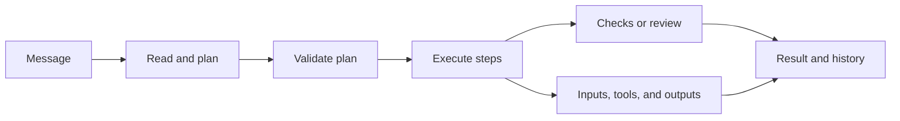

[English](README.md) | [中文](README.zh.md)

# Knotrail

**A desktop coding agent with visible plans, step-by-step execution, and a history you can inspect.**

Knotrail brings the [pi SDK](https://github.com/earendil-works/pi) into a local desktop workbench. Start with a message, follow the plan as it takes shape, and open any step to see its inputs, tool calls, changes, and results. Continue the conversation in the same workspace as the task develops.

Built for developers who want to follow and direct an agent's work throughout a task. The app supports English and Simplified Chinese, with a separate setting for the model's response language.

[](https://github.com/LAwLi3tCoding/knotrail/actions/workflows/verify.yml) · [MIT license](LICENSE) · **Early-stage · macOS**

## Why Knotrail

When requirements change halfway through a coding task, the next step depends on what has already happened: which files were read, which edits reached disk, which checks passed, and which findings still apply.

Knotrail keeps that work attached to the plan. Each step has its own inputs, attempts, outputs, and check results. You can inspect the current state, review the effect of a change, and continue with the earlier records still available.

## What you can do

- **Follow the plan as it develops.** A dedicated panel on the right shows planning drafts, the published plan, dependencies, and node progress. Toggle it independently; the conversation still shows task steps and questions that need your answer. Every task plans before execution, with a choice of automatic execution after validation or a pause for review.
- **Inspect how each result was produced.** Open a run to see its captured file or predecessor-artifact inputs, tool arguments and outputs, code changes, checks, and recorded decisions. Earlier attempts remain accessible after a retry. Export the task as a Markdown report.
- **Preview changes and retry selected work.** Review affected steps before applying a task revision or retry. Within the same plan, independent research can be retained when its recorded inputs, context, and outputs still match; each node shows why it will be reused or rerun. Changing the overall objective or acceptance checks starts a new revision and requires a new plan. Retrying uses the current files rather than rolling back the workspace.
- **Define what counts as done.** Add fixed check commands and protect their definitions from agent edits. Results are tied to the task version and the workspace that was checked. A conversation without checks ends its turn without claiming verified success; a planned task without checks waits for manual acceptance.
- **Run tasks that wait or check again later.** A bounded ongoing task can wait for a specified local file condition without repeatedly calling the model. Maintenance tasks rerun fixed checks on a schedule and record health and missed observations. These modes run while the app and computer are running; repairs are explicitly started by the user.

## The workbench

The interface uses a Codex-style project sidebar and central conversation, with activity and change views alongside an optional right planning panel. File, terminal, and artifact previews live in a separate bottom panel.

| Area | What it shows |
| --- | --- |
| Projects and tasks | Project groups, conversations, scheduled tasks, and settings |
| Conversation | Messages, task steps, recorded runs, and decisions to answer |
| Planning panel | Drafts, node dependencies, progress, and current or historical plans |
| Activity and changes | Tool events, outputs, and changes associated with each run |

A typical task follows this flow:



Plan review can pause the flow before execution. A new message continues the conversation in the same workspace and starts another planning cycle. For acceptance checks, budgets, and ongoing tasks, use the advanced options.

## Quick start

**Requirements:** macOS, Git, and Node.js 24 or newer. Native dependencies may require Xcode Command Line Tools. Bring your own model connection; the repository includes no model account or usage credits.

```sh
git clone https://github.com/LAwLi3tCoding/knotrail.git
cd knotrail
npm ci
npm run dev
```

The command builds the app and opens Electron. Rerun it after source changes.

1. Open **Settings → Model**. Choose an existing Codex ChatGPT login, or configure an OpenAI-compatible Chat Completions service with its base URL, exact model ID, and API key if required. A compatible local service can also be used.
2. Save the settings and check the connection. The Codex option checks the local login format and expiry; API mode checks the provider's `/models` response. Run a task to verify actual model and tool support.
3. Open a clean Git repository with at least one commit, enter a message, and send it. Continue in the same conversation after the response.

For a first task, try: “Explain how this project's main entry point reaches its core logic, and summarize the files involved.” To run fixed checks, expand the advanced options and enter a command as a JSON argument array, such as `["node", "check.mjs"]`, using a script that exists in your project.

See the [user guide](docs/USER-GUIDE.md) for model setup, task modes, checks, and recovery.

## Inside the repository

Knotrail includes the desktop app and the runtime behind it: **Electron + React + TypeScript**, a **SQLite** task store, and **pi SDK** model sessions. The core owns task state; the UI sends commands and displays saved snapshots and events. Each task works in a separate Git worktree.

```text
src/desktop/     Electron main process, preload, and desktop integration
src/renderer/    Bilingual React workbench and planning panel
src/core/        Task lifecycle, plans, retries, persistence, and Git workspaces
src/runtime/     pi sessions, model providers, and worker processes
src/execution/   File and command execution on macOS
src/shared/      Commands, snapshots, and shared types
```

The desktop layout draws on Codex, activity and configuration organization on [DeepSeek Harness](https://github.com/deepseek-ai/deepseek-harness), and tool-panel organization on Catdesk. Knotrail is an independent project.

## Development

```sh
npm run check
npx playwright install chromium
npm run test:ui
npm run test:desktop
npm run test:desktop:reuse
```

`check` runs type checking, unit tests, and the build. UI tests use controlled IPC fixtures; desktop tests exercise Electron, the core, and pi with a scripted local model service. They verify application behavior, not real-model task quality. See [validation records](docs/VALIDATION.md) for evidence and the separate live-model workflow.

```sh
npm run package
```

Packaging produces a macOS application directory under `release/`. The current build is unsigned and has no notarization or automatic update service.

## Current scope

Knotrail is under active development. The working app includes planning, execution records, local persistence, selective research reuse within a plan, and local waiting and maintenance. Cross-objective research reuse and broader real-model task evaluation remain in progress.

- Execution currently requires macOS. Projects must be clean Git roots with existing commits; symlinks and submodules are not supported.
- One task executes at a time across the app. Scheduling depends on the app staying open and the computer being awake.
- Task data stays on the local machine; requests and selected context go to the configured model service. Command execution does not load your shell configuration or inherit your credentials, and its network access is off by default.
- Use trusted repositories and commands. The current sandbox is not a VM, and detached background processes may outlive task cancellation. See the [execution boundaries](docs/SECURITY.md).
- Interrupted deterministic file writes can be checked against saved expected state; unresolved commands and other uncertain effects require user review. The app does not automatically commit, push, merge, or publish changes to your projects.

## Documentation

Detailed documentation is currently primarily in Chinese.

| Document | Contents |
| --- | --- |
| [User guide](docs/USER-GUIDE.md) | Setup, conversation and task modes, checks, and recovery |
| [Architecture](ARCHITECTURE.md) | Processes, task state, execution, and persistence |
| [Code guide](docs/CODE-GUIDE.md) | Modules, contracts, and call paths |
| [Research reuse](docs/RESEARCH-REUSE.md) | Eligibility, retry behavior, and retained evidence |
| [Validation](docs/VALIDATION.md) | Test methods, recorded results, and evidence limits |
| [Implementation status](docs/COMPLETION-AUDIT.md) | Detailed progress against the original plan |

## License

[MIT](LICENSE).
