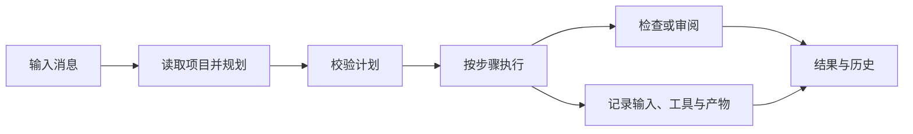

[English](README.md) | [中文](README.zh.md)
<!-- Synced with README.md as of 2026-09-07 -->

# Knotrail

**让编码 Agent 的计划、执行过程和每一步产出都看得见。**

Knotrail 是基于 [pi SDK](https://github.com/earendil-works/pi) 的本地编码 Agent 桌面应用。从一条消息开始，查看计划如何形成，再展开每个步骤，了解它读取了什么、调用了哪些工具、修改了哪些文件、得到什么结果。任务有了新要求，可以在同一工作区继续对话。

它面向希望在任务过程中查看进展、调整方向的开发者。界面支持简体中文和 English，模型回复语言可以单独设置。

[](https://github.com/LAwLi3tCoding/knotrail/actions/workflows/verify.yml) · [MIT 许可证](LICENSE) · **早期版本 · macOS**

## 为什么做 Knotrail

编码任务做到一半，需求可能变化。接下来怎么做，取决于之前发生了什么：哪些文件被读过、哪些修改已经落盘、哪些检查通过了、哪些研究结论还适用。

Knotrail 把这些记录放回计划中的每个步骤。步骤有自己的输入、历次尝试、产物和检查结果；调整任务时，可以先查看影响，再从当前状态继续，旧记录也始终可查。

## 主要特点

- **规划过程可见。** 右侧独立规划栏展示草稿、正式计划、节点依赖和执行进度，可以随时开关。关闭后，主对话仍展示任务步骤和待回答的问题。每项任务都先规划，再选择通过校验后自动执行，或停下来审阅计划。
- **每一步都有可查看的记录。** 展开一次运行，可以查看当时绑定的文件或前驱产物输入、工具参数与输出、代码变更、检查结果和已回答的决定。重试后仍能回看旧尝试，也可以导出 Markdown 任务报告。
- **修改和重试前先看影响。** 应用任务修订或重做节点前，先展示受影响的步骤。同一计划中，独立研究的输入、上下文和产物核对一致时可以保留；每个节点都会说明复用或重跑的原因。修改总目标或验收检查会创建新版本并重新规划。重试从当前文件继续，不会把工作区回退到旧状态。
- **完成标准由检查和审阅确定。** 可以设置固定检查命令，并保护检查定义不被 Agent 修改。检查结果绑定具体任务版本和当时的工作区。没有检查的快速会话只结束本轮回复，不标记验收通过；没有检查的计划任务则等待人工验收。
- **支持等待与周期复验。** 有限持续任务可以等待指定本地文件的条件满足，等待期间无需反复调用模型。维护任务按周期运行固定检查，记录健康状态与漏查情况。这些任务依赖 App 和本机持续运行，修复由用户明确发起。

## 工作界面

界面采用 Codex 风格的项目侧栏和中央对话区，配有活动、变更视图，以及可独立开关的右侧规划栏。文件、终端和产物预览位于独立的底部面板。

| 区域 | 展示内容 |
| --- | --- |
| 项目与任务 | 项目分组、会话、定时任务和设置 |
| 主对话 | 消息、任务步骤、运行记录和待回答的决定 |
| 规划栏 | 规划草稿、节点依赖、进度以及当前和历史计划 |
| 活动与变更 | 工具事件、输出及关联到具体运行的修改 |

一次任务的基本流程：



选择审阅模式时，流程会在执行前暂停。在同一会话中发送新消息，会沿用工作区并开始下一轮规划。验收检查、预算和持续任务可在高级选项中设置。

## 快速开始

**环境要求：** macOS、Git、Node.js 24 或更新版本。安装原生依赖时可能需要 Xcode Command Line Tools。模型服务需要自行配置，仓库不包含模型账号或使用额度。

```sh
git clone https://github.com/LAwLi3tCoding/knotrail.git
cd knotrail
npm ci
npm run dev
```

命令会构建应用并打开 Electron。修改源码后，重新运行即可。

1. 打开「设置 → 模型」。选择已有的 Codex ChatGPT 登录，或填写兼容 OpenAI Chat Completions 的服务地址、准确模型 ID，以及服务所需的 API 密钥。也可以接入兼容的本地模型服务。
2. 保存设置并检查连接。Codex 模式检查本机登录格式与有效期；API 模式检查服务的 `/models` 响应。实际模型响应与工具调用能力需要通过任务验证。
3. 打开一个已有提交、工作区干净的 Git 仓库，输入消息并发送。收到回复后，可以直接在同一会话继续。

第一个任务可以尝试：「解释这个项目的主入口如何调用到核心逻辑，并汇总涉及的文件。」需要固定检查时，展开高级选项，用 JSON 参数数组填写项目中已有的检查命令，例如 `["node", "check.mjs"]`。

模型配置、任务模式、检查和恢复操作详见[用户指南](docs/USER-GUIDE.md)。

## 仓库包含什么

仓库包含桌面应用及其运行时：**Electron + React + TypeScript** 前端与宿主、**SQLite** 任务存储，以及 **pi SDK** 模型会话。核心服务统一管理任务状态，界面发送命令并展示已保存的快照和事件。每项任务使用独立的 Git worktree。

```text
src/desktop/     Electron main process, preload, and desktop integration
src/renderer/    Bilingual React workbench and planning panel
src/core/        Task lifecycle, plans, retries, persistence, and Git workspaces
src/runtime/     pi sessions, model providers, and worker processes
src/execution/   File and command execution on macOS
src/shared/      Commands, snapshots, and shared types
```

桌面布局参考 Codex，活动与配置组织参考 [DeepSeek Harness](https://github.com/deepseek-ai/deepseek-harness)，工具面板组织参考 Catdesk。Knotrail 是独立项目。

## 开发与构建

```sh
npm run check
npx playwright install chromium
npm run test:ui
npm run test:desktop
npm run test:desktop:reuse
```

`check` 执行类型检查、单元测试和构建。UI 测试使用可控的 IPC 测试替身；桌面测试通过受控的本地模型服务运行 Electron、核心服务和 pi 链路。这些测试验证应用行为，不能代替真实模型的任务效果评估。实际记录和独立的真实模型验证流程见[验证文档](docs/VALIDATION.md)。

```sh
npm run package
```

打包后，macOS 应用目录位于 `release/`。当前构建没有开发者签名、公证或自动更新服务。

## 当前范围

Knotrail 仍在开发中。当前应用已包含规划、执行记录、本地持久化、同计划研究复用，以及本地等待和维护任务。跨目标研究复用与更广泛的真实模型任务评估仍在推进。

- 执行目前仅支持 macOS。项目需要是已有提交且工作区干净的 Git 根目录，暂不支持符号链接和子模块。
- 整个 App 同时执行一项任务。调度依赖应用保持打开、本机处于唤醒状态。
- 任务数据保存在本机；模型请求与选取的上下文会发送给配置的模型服务。命令执行不加载用户 shell 配置、不继承用户凭据，网络访问默认关闭。
- 只运行可信仓库和命令。当前沙箱不是虚拟机，主动脱离的后台进程可能在任务取消后继续运行，详见[执行边界](docs/SECURITY.md)。
- 中断后的确定性文件写入可以对照已保存的预期状态查证；未查明的命令和其他不确定效果仍需人工审阅。应用不会自动向用户项目提交、推送、合并或发布修改。

## 文档导航

详细文档目前以中文为主。

| 文档 | 内容 |
| --- | --- |
| [用户指南](docs/USER-GUIDE.md) | 配置、会话与任务模式、检查和恢复 |
| [实现原理](ARCHITECTURE.md) | 进程、任务状态、执行与持久化 |
| [代码指南](docs/CODE-GUIDE.md) | 模块、契约与调用链 |
| [研究复用](docs/RESEARCH-REUSE.md) | 复用条件、重试行为与保留记录 |
| [验证记录](docs/VALIDATION.md) | 验证方法、运行结果和证据范围 |
| [实现进展](docs/COMPLETION-AUDIT.md) | 原方案各项要求的详细完成状态 |

## 许可证

[MIT](LICENSE)。
