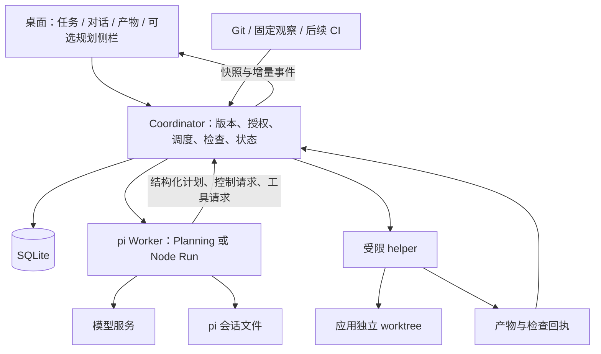

# Knotrail：架构与执行协议 v3.1

状态：2026-09-05，待实施设计。本版以 Codex 为主要桌面参照，结合 DSH 和本地 Catdesk 的页面布局；先规划后执行、独立右侧规划栏、双语界面和节点过程均为必需能力，替代 v2 的 CLI 先行路线。产品见 [PRODUCT-BRIEF.md](../PRODUCT-BRIEF.md)，界面见 [UI-DESIGN.md](../UI-DESIGN.md)，取舍与验证见 [COMPARISON.md](../COMPARISON.md)、[IMPLEMENTATION-PLAN.md](../IMPLEMENTATION-PLAN.md)。本文接口是拟定应用协议，不是 pi 或其他框架的原生 API。

## 1. 一条完整的产品链

```text
用户提交目标与范围
  → 只读规划：查项目、列事实和问题、形成计划草稿
  → 校验完整计划：节点、依赖、产物、完成条件、权限
  → 发布计划版本，在原授权内自动执行，或按用户选择等待审阅
  → 逐节点执行：固定输入 → pi 调工具 → 保存产物 → 独立检查
  → 遇到问题：显示具体节点、已有产出与继续条件
  → 修改目标/计划：显示版本差异和影响，查证后继续
  → 当前必需验收满足 → 交付累计补丁与各节点记录
```

所有任务都先规划。简单任务可以只有一个节点，复杂任务先组织为约 3—7 个有交付意义的节点；数字是默认呈现建议，不是硬性拆分门槛。数十次工具调用收在节点里，不画成数十个任务节点。

规划与执行使用同一个 pi SDK 接线、不同的工具范围和输入。一次规划或节点尝试是有限 Run；整个任务及计划可以跨 Run、会话、应用重启存在。图展示应用记录的事实，不能凭最终回答事后补出一段“执行过程”。

## 2. 任务、计划与执行分别归谁管

v2 的直接请求与长期委托统一为 `Task`，减少两套所有权分支。Task.mode 只有三种：

| mode | 用户语义 | 后续行动 |
| --- | --- | --- |
| once | 一次普通编码任务，也有计划与节点 | 可暂停、人工继续；不会自动变成长时间后台委托 |
| finite | 明确托管一个有限目标 | 等待已登记变化后继续，达到当前完成条件后结束 |
| maintain | 明确持续维护某项条件 | 定期/事件后复核，健康仅对应最近有效输入，不永久完成 |

TaskRevision 保存目标、范围和必需验收；PlanRevision 保存完成目标的步骤与依赖；Run 保存一次执行生命周期；pi Session 保存该次模型消息。这些事实不互相代替。用户不需要理解实体名称，界面统一称任务、计划版本、步骤与尝试。

首例是有实际兼容工作的依赖升级；另一例是一个涉及接口、页面、测试的小功能，用于证明日常开发与节点产物体验。持续文档示例维护用于后续验证时间维度。首版个人 macOS、单 Git 项目、一个活动效果执行器；无自动 push、merge、发布或向他人发消息。

## 3. 最小技术组成

| 部分 | 决定 | 原因与限制 |
| --- | --- | --- |
| 桌面 | Electron + React + 白名单 preload | M0 即交付桌面交互；CLI 仅作诊断，不先造完整编辑器 |
| 计划界面 | 可开关右侧规划栏内的过程 / 步骤视图；图、列表和节点详情同源；窄屏为右侧抽屉 | 先用少量节点和简单布局；确需缩放/复杂连线时使用成熟图组件，不自写通用图编辑器 |
| 工作区呈现 | 对话 / 活动 / 变更视图、独立工具面板、简体中文 / English 文案与偏好 | 共用任务快照和事件；布局与语言不成为第二套任务状态或运行入口 |
| Agent | `@earendil-works/pi-coding-agent` SDK | 唯一模型循环；Planning 与 Node execution 是运行配置，非两个框架 |
| 领域存储 | SQLite，Coordinator 唯一写入者，无 ORM/通用事件溯源框架 | 原子保存版本、待执行项和记录；不覆盖外部工具效果 |
| 运行 | 可信 Worker + 完整工具执行 helper | 项目代码和 shell 不进入宿主 Main；一次只推进一个节点的效果 |
| 等待 | 数据库 nextCheckAt + timer + 启动/唤醒补查 | 关机/休眠期间不运行；云端 SLA 成立后接成熟任务平台 |
| 扩展 | 应用随包的静态 source/context/tool/check 贡献 | Plan、授权、最终状态与取消是核心职责，不允许插件改写 |

SQLite 的作用是避免重写多文件事务，并不提供 shell/API 的恰好一次。[事务说明](https://www.sqlite.org/transactional.html) 桌面进程分工参考 [Electron 官方模型](https://www.electronjs.org/docs/latest/tutorial/process-model)。

当前 pi 源码固定为 [47236c84450656043dd8fb21c8513d1421505ae3](https://github.com/earendil-works/pi/tree/47236c84450656043dd8fb21c8513d1421505ae3)，读取包声明为 0.85.0；发布产物、Node/Electron 与 provider 兼容性仍须 M1 验证。AgentHarness 已有持久 operation/恢复实现，但所读版本的格式、watch/fork 有未完成边界，因此只做专项实验，不能为画计划图而换内核。[SDK](https://github.com/earendil-works/pi/blob/47236c84450656043dd8fb21c8513d1421505ae3/packages/coding-agent/src/core/sdk.ts)、[Harness](https://github.com/earendil-works/pi/blob/47236c84450656043dd8fb21c8513d1421505ae3/packages/agent/docs/harness.md)。

## 4. 组件与单一宿主



这些是同一本地应用的组件，不是微服务。Electron Main 中的 Coordinator 在加载可执行能力、写库或启动 Worker 前，获取同一规范化应用目录下的 OS 排他 owner lock。所有桌面/诊断 CLI 入口共用它；第二个宿主拒绝启动，不依赖“数据库中似乎没有 Run”或 PID 文件判断。

锁句柄保持到全部效果收尾，不删除看似过期的锁文件。崩溃接管同时要求锁释放和旧 helper/后代效果已确认停止；不能仅凭 PID 消失接管。无法查证时只能恢复查看与查证，不能写项目。成功接管后事务递增 hostEpoch，所有 Worker/RPC 携带并验证 epoch。Electron 自身单实例机制不能替代跨入口 owner lock。

## 5. 最小数据契约

| 对象 | 核心字段 | 所有权/不变量 |
| --- | --- | --- |
| Task / TaskRevision | taskId、projectId、revision、mode、objective、scopeRef、conditionSpecs、budget、expiresAt；activePlanRef | Coordinator 写入；Task 保存 currentRevision/activePlanRef 等当前指针，TaskRevision 保存不可变历史语义；activePlanRef 指向适配当前 TaskRevision 的计划 |
| PlanningDraft | draftId、taskRevision、basePlanRef、seq、observations、openQuestions、nodeDrafts | Planner 提议，Coordinator 校验保存；草稿不能启动效果 |
| PlanRevision | planId、revision、taskRevision、parentPlanRef、assumptionRefs、nodes、edges、contentDigest | 发布后内容不可变；布局坐标不改变执行语义；旧版只读 |
| PlanNode | nodeId、kind、goal、dependsOn、inputRefs、scopeRef、expectedOutputs、conditionRefs | 语义身份稳定；目标改变不能沿用旧内容摘要冒充同一节点 |
| Run | runId、taskRevision、purpose、planRef、nodeId、attemptNo、inputVector、profileHash、hostEpoch、epoch、status、sessionRef | purpose 为 planning 或 node；planning 可引用 draft，node 必须绑定已发布计划和节点 |
| Observation | source、subjectRef、sourceRevision、observedAt、digest、validity、payloadRef | source 产生，非模型断言；不可达为 unknown |
| Artifact | artifactId、runId、nodeId、kind、digest、baselineRef、inputRefs、storageRef | 执行器接收完整内容后登记；历史不可覆盖；补丁与最终累计 diff 区分 |
| ActionReceipt | runId、toolCallId、operationKey、argumentsDigest、outcome、artifactRefs | 执行边界产生 succeeded/failed/unknown，模型不能填结果 |
| CheckReceipt | conditionId、verifierVersion、inputVector、coverage、result、evidenceRefs、checkedAt | 独立检查器产生 pass/fail/unknown；coverage 区分节点检查与最终验收 |
| Decision / Wait | taskRevision、planRef、nodeId、actionDigest、问题/条件、期限、回答/唤醒状态 | 核心验证结构化请求后保存；原授权内不重复询问 |

NodeAttempt 使用 purpose=node 的 Run 记录，不再建第二套重复生命周期。`(taskId, planRef, nodeId, attemptNo)` 唯一；请求去重按 clientRequestId 单独约束，不把同一任务的多次 Run 当成重复提交。模型消息仍归 SessionManager。

另保存 UI 事件 sequence、通知状态与必要历史。产物先写完并计算摘要，事务再引用；数据库/产物失败停止新效果，缺失引用不能仍显示“证据完整”。任务修订、activePlan 切换、失效标记与待执行项更新在一个事务内提交。

## 6. 规划协议：从过程到可执行计划

Planner 只获得文件读取、受控搜索、Git broker 和核心控制工具；不获得 edit/write、任意 shell、项目脚本或外部写工具。规划期间可写自己的草稿与分析产物，不修改用户项目。仅在提示词写“不要修改”不足以保证这一点。

核心 `update_plan` 有两种操作：保存一组已完整解析的草稿变化；提交完整候选计划。请求绑定实际 caller 的 runId/draftId/taskRevision 和 expectedSeq，不能靠模型自填身份切换任务。摘要和来源引用需校验，未知字段、越界引用、过大内容与旧 sequence 被拒绝。

规划专栏流式展示四类公开工作记录：查到的事实及来源；约束与待决问题；候选方案及简短取舍理由；计划节点的增加、修改和依赖。它们是显式生成的工作记录，不是承诺读取完整内部思维链。普通 token 可即时显示为草稿；不完整 JSON 不生成可执行节点。

提交时校验：节点 ID 唯一、依赖存在且无环、输入有来源、预期产物清楚、每项用户必需验收有归属、效果范围不超授权、没有未解决的必要前置决定。允许未来节点引用前驱的预期输出，但前驱产物真正存在且有效前不得运行。

有效提交先保存候选，停止 Planner 并收尾，再重新核对 taskRevision、来源 generation、预算与必要决定；事务发布 PlanRevision 并切换 activePlanRef。失败保留草稿和具体错误，不边补计划边越过 Ready 执行。

默认 `executionPolicy=autoWithinGrant`：计划 Ready 后在原授权内自动推进。用户可以选择 `reviewBeforeExecute`，此时计划就绪后等待一次开始决定；已确认计划摘要或范围变了，旧决定失效。先规划不等于每个节点人工批准。新权限、新产品语义或明确指定的人工检查仍需相应决定。

## 7. 计划与节点如何执行

任务阶段为 `planning → ready → executing → verifying → completed`，另有 waiting_user、waiting_external、reconciling、blocked、paused、cancelled、expired。maintain 的正常终点是当前输入上 healthy，仍保持活动。首版 Decision 导致该任务进入 waiting_user 后暂停其全部新执行，回答并校验后继续；不增加节点级等待期间的旁路调度。

调度器从已发布计划选择依赖满足的节点。首版按依赖与稳定顺序串行执行，分支可以画出来，不因此开启多 Agent 或并发写。简单任务一张节点卡也走相同协议。

1. 核对当前 TaskRevision、activePlanRef、节点内容、输入与授权，持久记录 NodeAttempt 后才确认接受。
2. 固定输入：任务约束、当前计划/节点、有效前驱产物、相关项目材料、未知效果、验收要求；不搬入完整旧聊天。
3. 新建 pi Session 执行一个节点。该节点可含多轮模型请求和多次工具调用，不能每次工具调用都另建节点。
4. 每次工具准入再次核对 hostEpoch、Run epoch、activePlan、nodeId、最终参数和范围；效果记录归实际运行上下文，模型不能伪造归属。
5. 收集操作、产物、错误与停止建议；SDK settled 后执行固定检查，登记节点结果与验证覆盖。
6. 下一个节点只消费实际存在且当前可用的产物；阻塞、缺失、未知结果不以空文本占位跳过。

节点历史执行结果与当前证据有效性分开。一次尝试可以“当时执行成功”，同时“该结果现已过期”；不能抹掉历史，也不能把过期结果继续画成当前已验证。UI 将执行、产物、验证分别列出，最终完成不能只由模型勾选节点计算。

最终交付核对当前必需条件、累计工作区输入、仍有效的人工接受及无待处理相关变化。中间产物可以被后续节点有意替代；不要求所有历史快照永远不变。需要证明的是最终验收仍成立，且每个必需节点有已采用的产物、有效替代或明确处理记录。

## 8. 改计划与局部继续

用户修改目标、范围或必需验收时，先关闭旧输入的新效果入口，停止并查证活动执行，然后创建新的 TaskRevision 和 Plan 草稿。只是拆分步骤或调整依赖时可保留 TaskRevision，但仍须形成新的 PlanRevision。模型只能提出修订，不能用计划变更自行扩大权限。

影响预览来源于三部分：节点内容/依赖变更、实际消费的产物引用、已声明且可核对的源输入变化。显示“变化内容、受影响节点、需要重查的证据、可保留的记录、未知覆盖”。首版不做全程序语义影响分析；共享文件、shell 隐含输入或依赖关系不明时保守扩大复核范围。

计划版本与事实版本不同：已计划的正常文件修改会更新执行输入和后续产物，不导致每一条工具调用都重新规划；只有计划前提/目标/依赖路线失效才形成修订。应用自己的效果按 runId 与产物摘要关联，外部修改混入时刷新真实状态。

发布新版时检查草稿基于的旧 Plan 和输入是否仍当前；若期间又有变化，重新计算影响。事务切 activePlan、冻结旧版调度、登记失效和新待执行项。旧 Worker、旧审批、旧 UI 请求不能推动新计划；历史迟到事件只归旧尝试。

“从这一步继续”的含义是：关闭该任务的新效果入口并停止活动 Run → 核对当前工作区与有效输入，形成影响预览 → 对选定节点创建新 attempt → 按实际新产物复验必要下游。同一计划版本内重试也必须在一个事务中登记新 attempt、将所选节点及受影响下游标为待复核并撤销当前完成资格，然后才启动执行。此前的 pass 只保留在历史中；需复用的证据重新核对适用性，不能因 planRef 未变就继续放行最终完成。它不撤销外部世界，也不自动恢复整个旧目录。需要回退时，必须明确补丁、人工改动和不可逆效果，另做范围清楚的操作。

证据过期首先意味着重读或复验，不意味着自动重放修改。代码写节点默认不按缓存直接重放；保留历史补丁也不等于将它再次应用。独立分析结果只有输入/语义/授权均仍成立才可复用。完整依赖无法证明时保守重查，界面显示原因。

## 9. pi 接线与结构化控制

真实链为 `createAgentSession → AgentSession + Agent → agentLoop → transformContext/convertToLlm → ModelRuntime.streamSimple`。显式注入 ModelRuntime、SettingsManager、ResourceLoader、SessionManager 和 customTools，禁止默认发现项目/全局可执行扩展。

所读 SDK 使用 `noTools: "builtin"` 与 `tools` 显式白名单；仅提供 customTools 会额外保留内置工具。分别枚举 Planning 与 Node Run 的实际工具集合。全部工具首版声明 `executionMode: "sequential"`；核心控制工具永远保持 sequential。

`update_plan` 提交阶段、`propose_run_outcome` 接受结束建议后，核心先持久保存候选并关闭新效果，再在工具返回前触发 `session.abort()`，由外层持有并等待 Promise。不得在 tool.execute 内 await 自己的 idle。该 SDK 含 sequential 工具的批次按顺序执行，abort 后不启动后续调用；返回 terminate 不足以替代中止，因为其还有批次聚合语义。

| propose_run_outcome.kind | 必需数据 | 核心后续处理 |
| --- | --- | --- |
| request_decision | 具体问题、选择、拟改变的范围/条件/产物、来源引用 | 收尾后创建绑定版本的 Decision；回答后决定继续或重规划 |
| wait_external | 已登记 source/subject、支持的条件类型、检查建议 | 按模式与限额登记 Wait；once 不自动新增后台唤醒 |
| blocked | 原因码、缺失输入和证据 | 显示对应节点，保留成果，不猜测自动重试 |
| propose_complete | 当前节点候选产物与条件引用 | 仅触发节点核对；不能直接将整个任务标完成 |

有效提案幂等保存，一个 Run 只接受一个终结提案；不同内容的重复提交冲突。普通自由文本不创建 Decision、Wait 或成功状态。没有合法提案时按已保存证据核对；缺少继续依据就显示具体缺口，不无条件追加模型调用。

首个助手消息前 pi 可能尚未创建 session 文件，message_end 也早于持久追加，所以业务接受不能只看模型日志。每个 Run 新会话，旧会话只读；业务恢复不能靠重开旧 session 重放残留工具。

来源：[SDK](https://github.com/earendil-works/pi/blob/47236c84450656043dd8fb21c8513d1421505ae3/packages/coding-agent/src/core/sdk.ts)、[Agent loop](https://github.com/earendil-works/pi/blob/47236c84450656043dd8fb21c8513d1421505ae3/packages/agent/src/agent-loop.ts)、[AgentSession](https://github.com/earendil-works/pi/blob/47236c84450656043dd8fb21c8513d1421505ae3/packages/coding-agent/src/core/agent-session.ts)、[ToolDefinition](https://github.com/earendil-works/pi/blob/47236c84450656043dd8fb21c8513d1421505ae3/packages/coding-agent/src/core/extensions/types.ts)、[SessionManager](https://github.com/earendil-works/pi/blob/47236c84450656043dd8fb21c8513d1421505ae3/packages/coding-agent/src/core/session-manager.ts)。以上是源码依据，应用接线尚未运行验证。

## 10. 产物与验证的新鲜度

每项检查保存依赖的 inputVector，例如文件/工作区摘要、检查器配置、环境、TaskRevision、节点语义摘要和消费的产物。CI 额外包含仓库、提交和检查运行 ID；各来源保留自己的观察时间，不声称跨系统原子快照。

旧提交的绿灯只入历史；缺源版本事件只用于叫醒后刷新。来源不可达或身份失效为 unknown，不沿用旧 pass。验证前后相关摘要变化则作废；文件 watcher 只是提示。shell/工具链隐含依赖无法完整覆盖时，以工作区级检查保守复验并显示缺口。

最终接受绑定累计补丁摘要和当前 inputVector。模型不能删除必需检查或生成一个新脚本自证完成。项目测试若被改，详情显示该变化；用户固定的外置检查单独保护。通过只证明声明范围，公共接口语义仍可能需要审阅。

最终提交事务核对 TaskRevision、activePlan、相关 generation、有效验收与无待处理事件。之后才观察到的新变化不会篡改历史交付；finite 标记交付适用版本与新变化，maintain 则重查。

## 11. 完整效果边界与故障恢复

复用工具 schema/格式，但完整 execute，包括路径探测、临时输出、图片处理与所有子进程，都进入受限 helper。Worker 不保留默认 execute 旁路。规划工具和固定检查器同样受实际能力限制；测试/shell 本身可能有副作用。

准入顺序：校验最终参数 → 核对版本/节点/epoch/授权 → 必要决定 → 持久意图 → 执行 → 保存回执与内容 → 返回 SDK。已知输入变化后拒绝旧版本新写入；文件编辑核对预期内容，不能覆盖外部变化。数据库意图用于识别未知窗口，不是通用重放器。

| 中断位置 | 必须采取的行为 |
| --- | --- |
| 接受任务/节点但未启动 | 保留接收记录，核对后可排队；不伪造 pi 历史 |
| 动作开始但无最终回执 | outcome=unknown，冻结相关项目新写，先查证效果 |
| 已有回执但 SDK 结果未保存 | 保留动作证据，旧 Run 结束；新会话用核对结果继续 |
| 接受 Plan/节点控制提案后退出 | 先停止旧效果，再检查提案版本和输入；不自动重放旧会话 |
| helper 或其后代可能仍活着 | 可信监督/lifeline 确认终止前不启动新写；无证明即阻塞 |
| 数据库/产物写失败 | 停止新效果，保留错误与已有事实，不显示成功 |
| 晚到旧审批或事件 | 拒绝旧动作；历史结果归旧版本，不覆盖新视图 |

停止顺序为关闭新入口、冻结未决动作、SDK abort、终止 helper 进程树、确认退出、保存状态。Main 死亡时监督机制必须收尾；没有验证过这一点，写/shell 能力不交付。取消不会撤销已经完成的修改。

未知本地操作可在停止进程后核对差异，再跑受限检查；无法判定时请用户选择保留或重建工作区。将来外部写需要业务 operationKey、远端幂等或结果查询；新 toolCallId 不能绕过未知效果冻结，replay:never 也不是业务恰好一次。

权限涵盖规范化路径、受保护目录、env/cwd、工具链与网络。模型凭据只到可信 Worker，不进入 shell、renderer、日志或导出。Main 接收 helper 字节流生成产物，不跟随 helper 指定的宿主路径，防止符号链接借权。

## 12. 工作区、扩展与上下文

每项有写权限的 Task 拥有应用独立 worktree，多节点、多 attempt 继续累计修改；每次尝试记录基线，区分本次 diff 和最终累计 diff。源仓库变化不自动 rebase；按明确规则整合或交用户决定，再复验。用户已有改动须选择材料，不自动 stash/reset/clean。

Git broker 禁用 hooks、外部 diff/textconv/fsmonitor 等不受控执行，模型不能改共享 Git 元数据。submodule、二进制、忽略文件或缺失工具链未覆盖时明确显示。复制环境、依赖下载按已有授权执行，不能为了首例升级依赖默认开放所有网络。

DSH 借鉴点仍为 source/context/tool/check 的明确贡献、profile/bundle、激活/退出与工具管线。计划 schema、控制工具、授权与最终检查由核心持有，bundle 不可替换这些规则。清单请求权限不等于获得权限；同名贡献失败、激活失败撤销注册、退出逆序清理、活跃 Run 不热替换。[生命周期](https://github.com/deepseek-ai/deepseek-harness/blob/d347e703908d0406b7a7ef80e3a0e594d86b2215/docs/cordis-primer.md)、[工具管线](https://github.com/deepseek-ai/deepseek-harness/blob/d347e703908d0406b7a7ef80e3a0e594d86b2215/docs/tool-execution-pipeline.md)。

首版只运行随包可信代码；同进程 TypeScript API 不是第三方安全沙箱。普通项目规则/Skill 是输入材料，不是加载任意宿主代码的许可。

Planning 输入是目标、授权、当前来源、已知约束与开放问题；Node 输入增加计划版本、当前节点、有效前驱产物与验收。历史总结保留来源，不改写领域事实。每个节点开新会话有上下文重建成本，预算中记录；先用少量语义节点，不以“很多节点”衡量能力。

## 13. 前端读模型与交互协议

规划专栏、图、列表和节点详情只消费同一个 TaskSnapshot；其中包括 taskRevision、activePlanRef、draft、node outcomes、validity、attempts、artifacts、checks、decisions 和 lastObservedAt。UI 选中节点、缩放或布局不改变任务状态。

事件包含 taskId、eventId、seq、taskRevision、planRef、runId、nodeId、kind、payloadRef。规划草稿、工具开始/输出/结束、产物登记、检查完成、计划修订均用实际事件；token 动画不可伪装产物已保存。UI 先快照后接续事件，有 sequence 缺口重新取快照，按 ID 去重，拒绝旧事件回写新版本。大输出增量截断并提供完整产物引用；不阻塞 Worker 监听器以等待动画。

主界面以 Codex App 为主要参照，结合 DSH 的独立栏与事件投影、Catdesk 的项目导航与工具布局：左侧项目 / 任务，中间对话 / 活动 / 变更视图和底部输入，文件 / 终端 / 预览在独立工具面板查看。右侧规划栏可独立开关，窄屏固定从右侧抽屉展开；过程视图展示事实 / 问题 / 计划修订，步骤视图展示图或列表及所选节点详情。详情保留目标与输入、动作、产物、验证和历史。关闭侧栏让主区扩展，不丢失任何计划或节点记录，也不关闭其他面板。布局、参照来源、空状态和可访问性详见 [UI-DESIGN.md](../UI-DESIGN.md)。

对话、活动和变更是同一任务事实的不同读视图。选择视图只切换投影，不重新执行工具、不生成新的事件序列；活动与文件输出必须保留 runId、nodeId、artifactRef 和相应版本。原型中的文件树、终端与预览是明确标记的模拟内容。真实工具接线进入 M1，节点证据与变更引用进入 M2；终端面板的存在不增加任意 shell 旁路，也不引入独立浏览器执行器。

规划栏开关、当前过程/步骤视图及选中节点属于 UI preference，独立于 Task、Plan 和 executionPolicy；首次默认关闭，应用保存开关偏好，各任务分别保存选择。隐藏面板不暂停 Coordinator 或任务数据更新；重新打开先取得最新快照，缺事件时重同步，不能重发 Run 或重演规划。若节点在新版移除，选择回到步骤总览并说明原因。必要 Decision 在主对话使用同一 decisionId/版本显示并作答，不能只存在于隐藏面板，也不强制弹开面板。

应用语言同属 UI preference，正式设置为 `system | zh-CN | en`；首次跟随系统，中文映射简体中文，其余回退 English，手动选择持久保存。renderer 用稳定文案键与参数呈现状态、错误、控件和可访问名称；用户消息、模型历史回复、代码、路径、命令、工具原文与节点目标保持原文。切换语言只更新呈现，不改变 TaskRevision、PlanRevision、ID、输入草稿或面板状态，不重启 Worker、重发任务命令或重放事件。模型回复语言是独立配置，UI locale 不自动写入模型输入；凭据与模型配置仍遵循既有可信边界。

IPC 仅暴露具体操作：tasks.create/revise/pause/resume/cancel、plans.review/acceptRevision、nodes.previewRetry/retry、decisions.answer、artifacts.read、reports.export；请求携带 expectedRevision 和幂等 ID。计划“发布就绪”由核心产生，renderer 不能通过改状态启动 Run。工具输出/Markdown/链接经安全呈现，renderer 关闭 Node integration，开启 context isolation/sandbox。

原型中的模拟流只用于交互判断，生产不能用计时器填充假进度。界面展示已检查节点数量及实际状态，不把节点数比例当剩余时间或真实完成百分比。

## 14. 预算、长期等待与后续边界

Planning、重规划、节点尝试与总结共同计入 Task 预算；各 Run 有时长、请求和工具上限。重复输入/同样失败无新依据时停止重试，不循环“计划—执行—再计划”。用量未知显示缺失，不用时长伪装费用硬上限。

每个有限/持续委托仅一项 pending wakeup，重复事件合并，自己产生的修改不递归叫模型。启动/系统唤醒扫描到期 Wait，刷新来源与计划前提，合并错过周期；无法补齐的事件时间段显示观测缺口。once 任务恢复需用户继续，不自动升级为后台维护。

导出包含任务/计划版本、节点产物、动作与检查引用；不承诺跨 runtime 会话兼容。备份/迁移只在无效果写入时进行，保留一致产物引用与旧库；不修改 pi 私有格式恢复工具。

后续只有出现真实需求才增加：多仓/多 Agent、云执行/Temporal/Trigger.dev、第三方插件隔离、业务幂等的外部写、候选技能演进。图的存在不要求 LangGraph/Mastra 进入运行内核；若自有流程复杂到难以维护，应比较整体采用框架的成本，不叠第二套权威状态。

v3 的价值必须在计划更改、证据失效与局部继续场景中证明。当前没有实现、运行安全、性能或竞争优势的通过证据。
